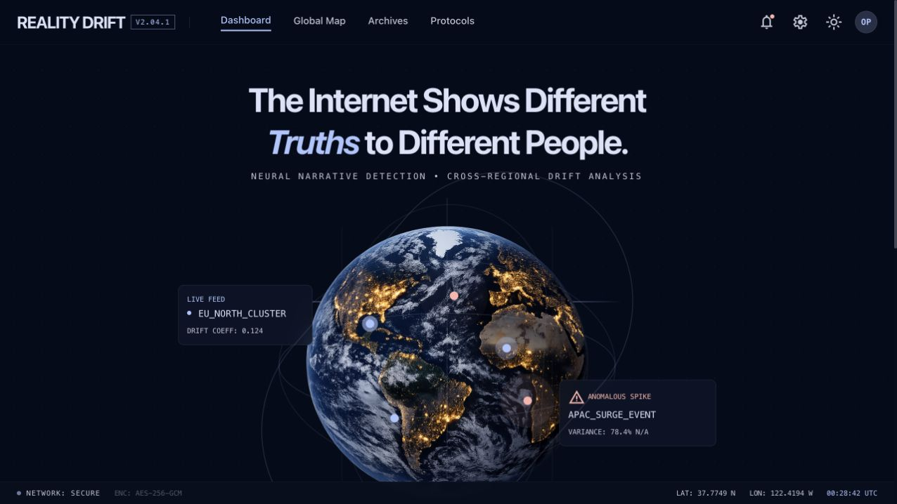
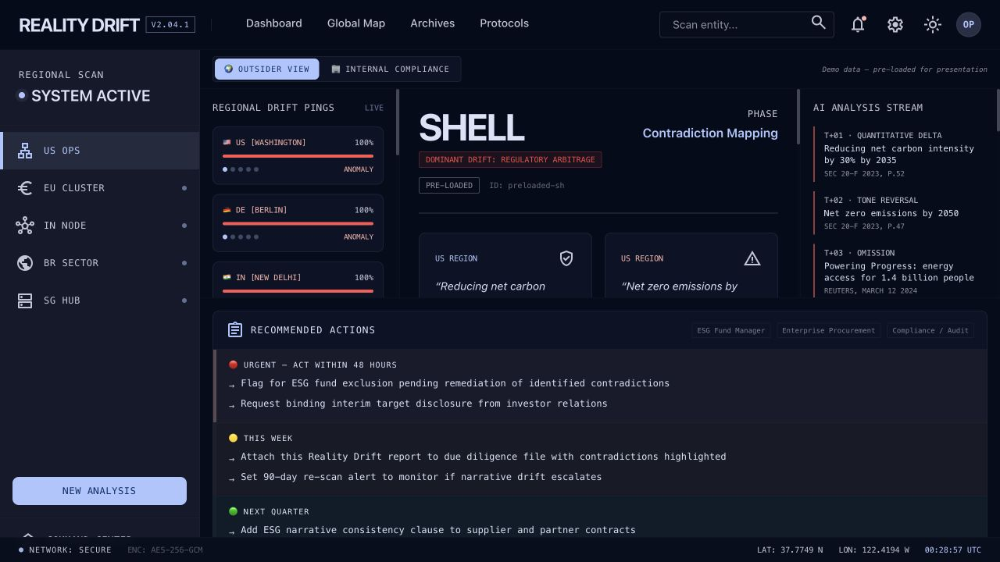
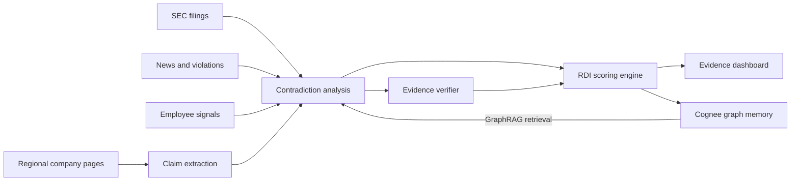
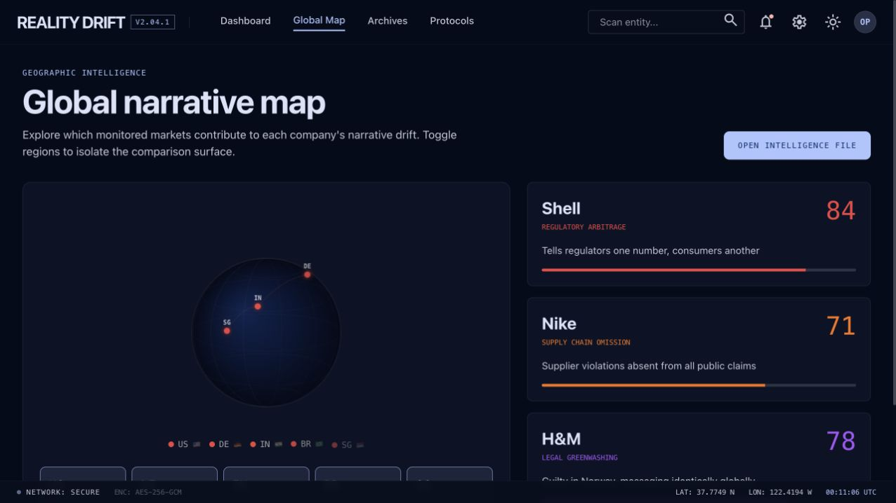

# Reality Drift

> The internet shows different truths to different people. Reality Drift catches the gap.

[](https://reality-drift-rho.vercel.app)
[](https://github.com/medhavee-upadhyaya/reality-drift/actions/workflows/ci.yml)
[](LICENSE)

Reality Drift is an open-source narrative observability platform. It compares corporate sustainability claims across countries, regulatory filings, news, and employee signals, then turns the inconsistencies into an explainable **Reality Drift Index (RDI)** with source-level receipts, independent evidence verification, and knowledge-graph memory.

**[Try the live demo](https://reality-drift-rho.vercel.app)** — choose Shell, Nike, or H&M for an instant, API-key-free analysis.



## Why this exists

A company can promise one emissions target to customers, qualify it in an SEC filing, omit a controversy in another market, and soften the language somewhere else. Those differences are difficult to spot because the evidence is scattered across regions and formats.

Reality Drift puts those claims side by side and answers three questions:

- What changed across regions?
- What does the company say when the statement becomes legally accountable?
- Is the gap isolated, or is it getting worse over time?

## The demo moment

Open the [Shell intelligence file](https://reality-drift-rho.vercel.app/analyze/shell). Reality Drift surfaces a public **30% reduction** claim against a **20% target subject to market conditions** in the regulatory filing—a 10-point disclosure gap—then shows the evidence, severity, drift fingerprint, and next actions.



| Instant demo | RDI | What Reality Drift finds |
| --- | ---: | --- |
| Shell | **84** | Regulatory arbitrage between public targets and SEC language |
| H&M | **78** | Greenwashing language persisting across markets after regulatory action |
| Nike | **71** | Supply-chain risks disclosed in filings but omitted from regional claims |

The bundled demo records keep the core experience reliable even when external APIs are unavailable. Live scans can use the complete data pipeline.

## How it works



The score is deliberately inspectable:

```text
RDI = geographic drift × 0.30
    + claim vs evidence × 0.35
    + temporal drift × 0.20
    + disclosure gap × 0.15
```

See [the scoring methodology](docs/SCORING.md), [AI system design](docs/AI_SYSTEM.md), and [architecture notes](docs/ARCHITECTURE.md) for the assumptions and implementation details.

## Product surfaces

- **Outsider View** — evidence-first analysis for researchers, journalists, investors, and procurement teams.
- **Internal Compliance** — pre-publish claim checks, regional ownership, readiness scoring, and remediation actions.
- **Presentation Mode** — press `Cmd/Ctrl + Shift + D` on a dashboard to remove demo labels for a clean walkthrough.
- **Live analysis** — an eight-stage streaming pipeline with visible progress instead of a black-box loading screen.
- **Independent verification** — every proposed contradiction can be verified, disputed, or marked as insufficient evidence.
- **GraphRAG memory** — relevant prior analyses are retrieved before current reasoning while current sources remain the required proof.
- **Traceable provenance** — source URLs, retrieval times, and SHA-256 evidence hashes make findings reproducible.
- **Global Map** — interactively isolate monitored regions and open company intelligence files.
- **Archives** — retain opened analyses locally with search and risk sorting.
- **Protocols** — inspect safeguards and experiment with RDI weights without changing production scoring.
- **Alerts and Settings** — persist monitoring thresholds and workspace preferences in the browser.



## Stack

| Layer | Technology |
| --- | --- |
| Interface | Next.js 14, TypeScript, Tailwind CSS, Framer Motion, Recharts |
| API | FastAPI, Pydantic, Server-Sent Events |
| Reasoning | Claude claim extraction, comparison, and classification pipeline |
| Collection | Bright Data regional proxies, Web Unlocker, SERP, Scraping Browser, Web Scraper API |
| Memory | Cognee knowledge graph + GraphRAG retrieval |
| Deployment | Vercel + Railway |

## Run locally

The three demo companies work without paid API credentials.

```bash
git clone https://github.com/medhavee-upadhyaya/reality-drift.git
cd reality-drift

# terminal 1 — API
cd backend
python3 -m venv .venv
source .venv/bin/activate
pip install -r requirements.txt
cp .env.example .env
uvicorn main:app --reload

# terminal 2 — web app
cd frontend
npm ci
printf 'NEXT_PUBLIC_API_URL=http://localhost:8000\n' > .env.local
npm run dev
```

Open [http://localhost:3000](http://localhost:3000), then choose a demo target.

For live scans, add your Anthropic and Bright Data credentials to `backend/.env`. The complete variable reference and deployment guide lives in [docs/ENV_AND_DEPLOY.md](docs/ENV_AND_DEPLOY.md).

## API at a glance

| Method | Endpoint | Purpose |
| --- | --- | --- |
| `GET` | `/health` | Service health |
| `GET` | `/api/companies/{slug}` | Bundled evidence file |
| `POST` | `/api/analyze` | Run the full analysis pipeline |
| `GET` | `/api/analyze/stream` | Stream pipeline progress with SSE |
| `GET` | `/api/history/{company}` | Retrieve temporal drift history |
| `POST` | `/api/compliance/check-claim` | Check a draft claim before publishing |

Full request and response shapes are documented in [docs/API.md](docs/API.md).

## Repository map

```text
backend/              FastAPI routes, collectors, AI pipeline, scoring, memory
frontend/             Next.js application and bundled demo records
docs/                 Architecture, API, scoring, integration, and deploy notes
docs/screenshots/     Current product screenshots used by this README
DEMO_SCRIPT.md        Five-minute walkthrough
```

### Application routes

| Route | Purpose |
| --- | --- |
| `/` | Command center and analysis entry |
| `/map` | Global regional intelligence map |
| `/archives` | Searchable local analysis history |
| `/protocols` | Methodology and RDI weight simulator |
| `/alerts` | Monitoring rules and triggered demo alerts |
| `/settings` | Persistent workspace preferences |
| `/analyze/{company}` | Outsider evidence dashboard |
| `/compliance/{company}` | Internal compliance workflow |

## Contributing

Ideas, issue reports, evidence-source integrations, and scoring critiques are welcome. Read [CONTRIBUTING.md](CONTRIBUTING.md) before opening a pull request. Please use sourced, reproducible examples and avoid presenting an RDI score as a legal conclusion.

## Responsible use

Reality Drift identifies inconsistencies for research and compliance workflows; it does not determine intent, liability, or legal guilt. Live web content may be incomplete or change over time. Always review the underlying sources before making a consequential decision. Security issues should follow [SECURITY.md](SECURITY.md).

Built for the Web Data UNLOCKED hackathon. Released under the [MIT License](LICENSE).
